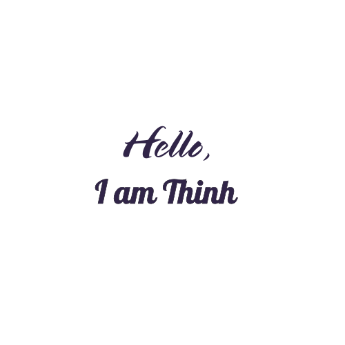

---

<h3 quote align='center'>If you stopped seeing the world in terms of what you like and what you dislike, and saw things for what they truly are in themselves, you would find a great deal more peace in your life .</h3 quote>

---

  

 

# 💫About Me :
- 🔭 I'm currently studying in University of Information Technology. I major in Computer Science.
- 💻 My career path is towards becoming an project manager/team lead. I'm currently **studying Computer Vision, which is a branch of Artificial Intelligence.**

## 🌐Socials

  
  

    
## Tech Stack

  <!-- C++ -->
  
  <!-- Python -->
  
  <!-- Git -->
  
  <!-- GitKraken -->
  
  <!-- MySQL -->
  
  <!-- NumPy -->
  
  <!-- Matplotlib -->
  
  <!-- Scikit-Learn -->
  

